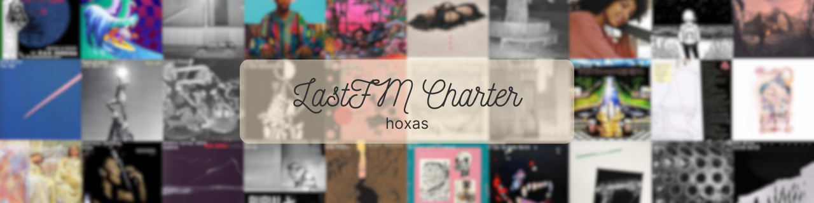

<p align="center">
  <a href="" rel="noopener">
 </a>
</p>
<div align="center">

[]()
[](https://github.com/hoxas/lastfm-charter/issues)
[](https://github.com/hoxas/lastfm-charter/pulls)
[](/LICENSE)

</div>

---

## Table of Contents

- [Table of Contents](#table-of-contents)
- [About](#about)
  - [Why?](#why)
  - [Important Note](#important-note)
  - [To Do](#to-do)
- [Getting Started](#getting-started)
  - [Prerequisites](#prerequisites)
  - [Installing](#installing)
    - [.env example](#env-example)
- [Deployment](#deployment)
- [Usage](#usage)
  - [API Paths](#api-paths)
  - [Period options](#period-options)
  - [Chart Shape options](#chart-shape-options)
  - [Usage Examples](#usage-examples)
- [Configuration Info](#configuration-info)
  - [Environment Variables](#environment-variables)
  - [Expiration time](#expiration-time)
- [Built using](#built-using)
- [Authors](#authors)
- [Acknowledgements](#acknowledgements)

## About

LastFM personal charting API specifically made for use with github readmes image proxying by sending cache-control headers.

### Why?

I was trying to use other public alternatives for collage/chart generation but they didn't send the cache-control headers, so they wouldn't update on github readme and I had no way of setting a specific time for it to revalidate except for github actions sending "curl -X PURGE..." to the camo urls, and somehow still the image ended up breaking some hours after the PURGE request.

So I made this configurable API where you can define how much time after image generation it will get stale requiring github to revalidate it.

### Important Note

It is important to note that even though this API is public it doesn't really offer a way to select a LastFM user and **that's intentional**.

The user is set through environment variables instead of through the request URL so if you want to have your own charts being generated you can follow the guide [below](#deployment) to deploy your own copy of this API with your own user and api key.

### To Do

- [ ] Implement transparent background behind album info text
- [ ] Include a main api swagger page on "/" url for further documentation
- [ ] Make another public API. Maybe?

## Getting Started

These instructions will get you a copy of the project up and running on your local machine for development and testing purposes. See [deployment](#deployment) for notes on how to deploy the project on a live system.

### Prerequisites

What things you need to install the software and how to install them.

```
Python >= 3.9 (current vercel's python version)
```

### Installing

A step by step series of examples that tell you how to get a development env running.

Clone repo and cd into it

```
git clone "https://github.com/hoxas/lastfm-charter" && cd lastfm-charter
```

Create virtual environment

```
python -m venv venv
```

Activate virtual environment

```
Unix or MacOS:
source venv/bin/activate

Windows:
venv\Scripts\activate
```

Install requirements from "requirements.txt" file

```
pip install -r requirements.txt
```

Create .env file

```
Unix or MacOS:
touch .env

Windows:
type NUL >> .env
```

Afterwards copy (with your preferred method) the content from ".env.example" into ".env" replacing the variables with your specific desired values.

#### .env example

```
LASTFM_API_KEY=asdsdjdskladksksdjsadkljdkl
LASTFM_USER=random_user
EXPIRATION_TIME=86400
```

For further info on .env values refer to [configuration](#configuration-info).

Run the api server

```
python main.py
```

Finally test it by requesting a simple chart:\
http://localhost:5000/api/week/4x4

## Deployment

Before deploying I recommend testing locally to make sure that the environment variables (API KEY, LASTFM USER) are working correctly.

Afterwards simply fork this [repo](https://github.com/hoxas/lastfm-charter) by clicking on the fork button.

Go to:\
https://vercel.com/new

Import the repository you've just forked and set the [environment variables](#environment-variables) through the GUI.


Finally just click deploy and wait till the deploy is complete.

Test it by requesting a simple chart:\
your-project-name.vercel.app/api/week/2x2

## Usage

The API needs to be setup with the proper environment variables in order to work, refer to [configuration info](#configuration-info) for further info.

### API Paths

The API has one path with one method:

```
/api/<period>/<chart_shape> - GET
```

### Period options

```
week - weekly chart
month - monthly chart
year - yearly chart
overall - all-time chart
```

### Chart Shape options

You can pass any shape in the format "numberxnumber" (x-axis by y-axis)\
Examples:

```
10x10
8x4
16x1
```

### Usage Examples

```
/api/week/10x10
/api/month/5x4
/api/year/2x2
/api/overall/7x5
```

## Configuration Info

All the environment variables are needed and must be passed to the vercel environment (deployment) or written in the .env file (locally)

### Environment Variables

The values need to be set as follows:

```
LASTFM_API_KEY=your_lastfm_api_key
LASTFM_USER=your_lastfm_username
EXPIRATION_TIME=your_expiration_time_in_seconds
```

Get your lastfm API key at:\
https://www.last.fm/api/account/create

### Expiration time

Expiration time\* is in seconds. Examples:

```
- daily = 86400
- weekly = 604800
- monthly (30 days) = 2592000
- always revalidate = 0 (duhh)
```

\* **It is important to note that the expiration time's sole purpose is for github to know when it should revalidate the image back with the API, this means that whenever you access the API directly through your URL the image will always be the most recent (recreated).<br><br>But since github internally caches the images it doesn't send a request everytime we reload the page, hence we need this variable.**

## Built using

- [Python](https://www.python.org/) - Scripting Language
- [lastfm-py](https://github.com/twitch0001/lastfm-py) - LastFM API Wrapper
- [Quart](https://quart.palletsprojects.com/) - API Server Framework
- [Pillow](https://python-pillow.org/) - Image Manipulation Library

## Authors

- [@hoxas](https://github.com/hoxas) - Project Creator

## Acknowledgements

- [@twitch0001](https://github.com/twitch0001) - Creator of lastfm-py lib
- [Last.fm Profile Readme](https://github.com/Monochromish/lastfm-profile-readme) - Inspired by
